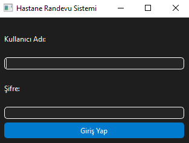
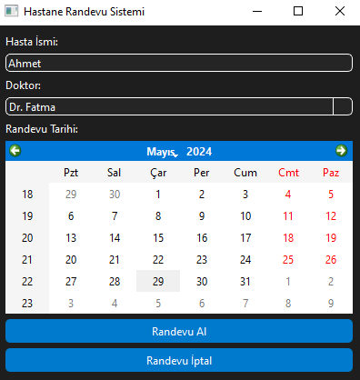
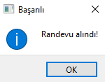
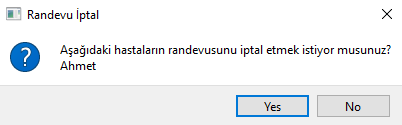
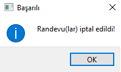

# Hastane Randevu Sistemi Uygulaması

Bu yazıda, PyQt6 kullanarak bir hastane randevu sistemi uygulaması oluşturduk. Bu uygulama, hastaların doktorlardan randevu almasını sağlar, doktorların müsaitlik durumlarını yönetir ve randevu iptallerini gerçekleştirir.

## Giriş Ekranı

Uygulama başladığında, bir giriş ekranı görüntülenir. Kullanıcı adı ve şifre istenir. Doğru kullanıcı adı ve şifre girilirse, başarılı giriş bilgilendirme ile karşılanır.

## Randevu Sistemi Arayüzü

Başarılı giriş yapıldığında, hastane randevu sistemi arayüzüne yönlendirilirsiniz. Bu arayüzde randevu almak veya iptal etmek için seçenekler bulunur.

## Randevu Alma

"Hasta İsmi", "Doktor" ve "Randevu Tarihi" seçilerek "Randevu Al" butonuna tıklanır. Eğer seçilen doktorun o tarihte müsait olduğu kontrol edilirse randevu alınır.

## Randevu İptali

"Randevu İptal" butonuna tıklanarak, iptal edilecek randevu tarihi ve doktor seçilir. Ardından eğer o tarihte randevusu olan hastalar bulunursa, onay alınarak randevuları iptal edilir.

